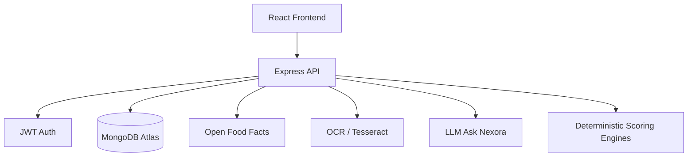

# NEXORA Backend

Personalized packaged-food intelligence API for the NEXORA platform.

## Features

- JWT authentication and mandatory personalization profiles
- Open Food Facts search, barcode lookup, and product caching
- Deterministic nutrition + ingredient analysis and scoring
- Personalized suitability scoring (allergies, diet, goals)
- Image upload + OCR extraction and package vs database verification
- Real alternative recommendations from Open Food Facts
- Ask Nexora grounded chat over analysis context
- Analysis history persisted in MongoDB

## Architecture



Scoring pipeline:

Raw Product → Normalization → Nutrition Analyzer → Ingredient Analyzer → Overall Score → Personalized Score → Structured Explanation → Optional LLM wording

## Setup

```bash
cd backend
cp .env.example .env
# fill MONGODB_URI, JWT_SECRET, optional LLM_API_KEY
npm install
npm run dev
```

Health check: `GET http://localhost:5000/api/health`

## Environment

See `.env.example`. Never commit `.env`.

## API Overview

| Method | Path | Auth |
|--------|------|------|
| POST | /api/auth/register | No |
| POST | /api/auth/login | No |
| GET | /api/auth/me | Yes |
| GET/PUT | /api/users/profile | Yes |
| GET | /api/products/search?q= | Yes + profile |
| GET | /api/products/barcode/:barcode | Yes + profile |
| GET | /api/products/:id | Yes + profile |
| POST | /api/products/analyze-image | Yes + profile |
| POST | /api/analysis/product/:productId | Yes + profile |
| GET | /api/analysis/:analysisId | Yes + profile |
| POST | /api/verification/:analysisId | Yes + profile |
| GET | /api/recommendations/:analysisId | Yes + profile |
| POST | /api/ask-nexora | Yes + profile |
| GET | /api/ask-nexora/history/:analysisId | Yes + profile |
| GET | /api/history | Yes + profile |
| GET | /api/health | No |

## Testing

```bash
npm test
```

## Security notes

- Passwords hashed with bcrypt
- JWT bearer auth
- Helmet, CORS, rate limiting, mongo sanitization
- Upload type/size limits
- Secrets only via environment variables

## Limitations

- Open Food Facts coverage varies by product and country
- OCR quality depends on image clarity; low confidence is surfaced to users
- Without `LLM_API_KEY`, Ask Nexora uses a grounded deterministic fallback
- NEXORA does not diagnose or treat medical conditions
